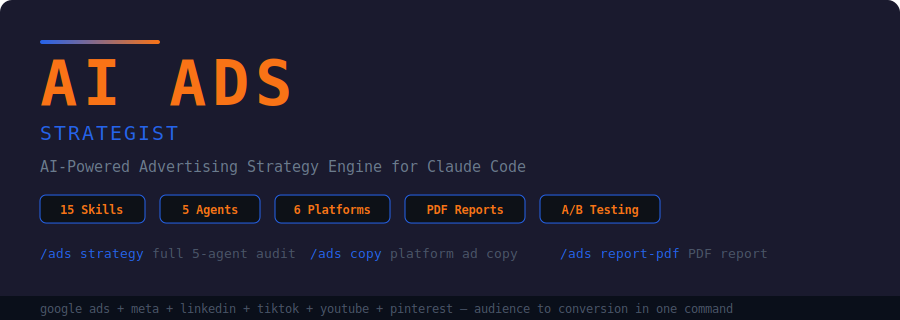

<p align="center">
  
</p>

<p align="center">
  <strong>AI Ads Strategist for Claude Code.</strong> Build complete ad strategies, generate platform-specific copy,<br/>
  design campaign funnels, allocate budgets, and produce client-ready PDF reports — 15 skills, 5 parallel agents, 6 platforms.
</p>

<p align="center">
  <a href="https://opensource.org/licenses/MIT"></a>
  
  
  
  
  
</p>

---

## Quick Start

```bash
curl -fsSL https://raw.githubusercontent.com/zubair-trabzada/ai-ads-claude/main/install.sh | bash
```

That's it. One command installs all 15 skills, 5 agents, and the PDF generation scripts.

---

## What Is This?

AI Ads Strategist is a complete advertising strategy engine built as Claude Code skills. It turns a single URL into a full ad strategy — audience personas, platform-specific copy, campaign funnels, budget allocation, competitive intelligence, and a professional PDF report.

Run `/ads strategy <url>` and 5 AI agents launch in parallel to analyze your business and produce a complete advertising playbook.

No ad platform login required. No API keys. Just Claude Code.

---

## Architecture

```
                          /ads strategy <url>
                                  |
                    ┌─────────────┼─────────────┐
                    |             |             |
              ┌─────┴─────┐ ┌────┴────┐ ┌──────┴──────┐
              | ads-audience| |ads-funnel| |ads-creative |
              | agent      | | agent    | | agent       |
              | (personas, | | (TOFU/   | | (copy,      |
              |  targeting)| |  MOFU/   | |  hooks,     |
              |            | |  BOFU)   | |  video)     |
              └────────────┘ └─────────┘ └─────────────┘
                    |             |             |
              ┌─────┴──────┐ ┌───┴─────┐
              |ads-competitive| |ads-budget|
              | agent        | | agent    |
              | (competitor  | | (alloc,  |
              |  gaps, ads)  | |  ROI)    |
              └──────────────┘ └─────────┘
                    |             |             |
                    └─────────────┼─────────────┘
                                  |
                    ┌─────────────┴─────────────┐
                    |   Composite Ad Readiness   |
                    |   Score (0-100) + Grade    |
                    |   + PDF Strategy Report    |
                    └───────────────────────────┘
```

---

## All 15 Commands

### Strategy & Analysis

| Command | What It Does |
|---------|-------------|
| `/ads strategy <url>` | **Flagship** — Full ad strategy with 5 parallel agents. Returns Ad Readiness Score (0-100), audience personas, campaign structure, ad copy, budget allocation, and prioritized action plan. |
| `/ads quick <url>` | 60-second ad readiness snapshot — value proposition, offer strength, CTA quality, platform recommendation. |
| `/ads audience <url>` | Build detailed audience personas with demographics, psychographics, platform preferences, and targeting parameters. |
| `/ads competitors <url>` | Competitive ad intelligence — what competitors are running, where they spend, gaps to exploit. |
| `/ads keywords <url>` | Google Ads keyword strategy — search intent mapping, negative keywords, match types, bid recommendations. |
| `/ads audit` | Audit existing ad performance — identify wasted spend, underperforming campaigns, optimization opportunities. |

### Creative & Copy

| Command | What It Does |
|---------|-------------|
| `/ads copy <platform>` | Generate platform-specific ad copy — headlines, primary text, descriptions, CTAs for any platform. |
| `/ads hooks` | Generate 20 scroll-stopping hooks — pattern interrupts, curiosity gaps, bold claims for social ads. |
| `/ads creative <product>` | Creative briefs for designers and editors — visual direction, format specs, brand guidelines. |
| `/ads video <product>` | Video ad scripts in 15s, 30s, and 60s formats — hook, body, CTA with shot-by-shot direction. |

### Funnel & Budget

| Command | What It Does |
|---------|-------------|
| `/ads funnel <url>` | Full ads funnel architecture — TOFU/MOFU/BOFU/Retargeting with ad types, audiences, and KPIs per stage. |
| `/ads budget <amount>` | Budget allocation across platforms — percentage splits, monthly amounts, projected CPM/CPC/CPA/ROAS. |
| `/ads testing <campaign>` | A/B testing plan — variables to test, sample sizes, duration, success criteria, statistical significance. |
| `/ads landing <url>` | Landing page audit — conversion blockers, CTA analysis, trust signals, rewrite recommendations. |

### Reporting

| Command | What It Does |
|---------|-------------|
| `/ads report-pdf` | Professional 6-page PDF strategy report — score dashboard, personas, funnel, ad copy, budget projections. |

---

## Supported Platforms

| Platform | Ad Types | Best For |
|----------|----------|----------|
| **Google Ads** | Search, Display, Shopping, YouTube | High-intent search, product listings, retargeting |
| **Meta (Facebook/Instagram)** | Feed, Story, Reels, Carousel, Lead Forms | B2C, e-commerce, local businesses, lookalike audiences |
| **LinkedIn** | Sponsored Content, InMail, Text Ads | B2B, SaaS, professional services, recruiting |
| **TikTok** | In-Feed, TopView, Spark Ads, Branded Effects | Gen Z/Millennial, e-commerce, creators, viral content |
| **YouTube** | Pre-Roll, Mid-Roll, Bumper, Discovery | Brand awareness, product demos, tutorials, retargeting |
| **Pinterest** | Standard Pin, Video Pin, Shopping, Carousel | E-commerce, lifestyle, home, fashion, food, DIY |

---

## Scoring Methodology

The **Ad Readiness Score** (0-100) is a weighted composite of 5 dimensions:

| Category | Weight | What It Measures |
|----------|--------|------------------|
| Audience Clarity | 25% | ICP definition, persona depth, targeting precision |
| Creative Quality | 20% | Hook strength, copy quality, visual concepts, video scripts |
| Funnel Architecture | 20% | Campaign structure, stages, retargeting, conversion path |
| Competitive Position | 15% | Differentiation, competitor gaps, market opportunity |
| Budget Efficiency | 20% | Allocation strategy, platform mix, projected CPM/CPC/CPA |

### Grade Interpretation

| Grade | Score | Meaning |
|-------|-------|---------|
| **A+** | 95-100 | Elite — campaign-ready, launch immediately |
| **A** | 90-94 | Excellent — minor optimizations before launch |
| **A-** | 85-89 | Very strong — refine targeting or creative |
| **B+** | 80-84 | Good — solid foundation, needs polish |
| **B** | 75-79 | Above average — some gaps to address |
| **B-** | 70-74 | Decent — noticeable improvements needed |
| **C+** | 65-69 | Fair — multiple areas need attention |
| **C** | 60-64 | Below average — significant work required |
| **C-** | 55-59 | Weak — major gaps in strategy |
| **D+** | 50-54 | Poor — fundamental issues across categories |
| **D** | 45-49 | Very poor — strategy overhaul recommended |
| **D-** | 40-44 | Critical — not ready for paid advertising |
| **F** | 0-39 | Failing — build foundations before spending on ads |

---

## Sample Output

### `/ads strategy`

```
╔══════════════════════════════════════════════════════════════╗
║  AI ADS STRATEGY REPORT                                      ║
║  Acme Growth Co. — acmegrowth.com                            ║
╚══════════════════════════════════════════════════════════════╝

AD READINESS SCORE: 67/100 (Grade: C+)

┌──────────────────────┬───────┬────────┬──────────┐
│ Category             │ Score │ Weight │ Status   │
├──────────────────────┼───────┼────────┼──────────┤
│ Audience Clarity     │ 72    │ 25%    │ Needs Work│
│ Creative Quality     │ 65    │ 20%    │ Needs Work│
│ Funnel Architecture  │ 58    │ 20%    │ Needs Work│
│ Competitive Position │ 70    │ 15%    │ Needs Work│
│ Budget Efficiency    │ 62    │ 20%    │ Needs Work│
└──────────────────────┴───────┴────────┴──────────┘

TOP 3 QUICK WINS:
  1. Add retargeting campaign for website visitors (missing BOFU)
  2. Replace generic CTAs with benefit-driven copy
  3. Create Meta Lookalike audience from customer email list

Saved: ADS-STRATEGY-AcmeGrowth.md
```

### `/ads quick`

```
⚡ AD READINESS SNAPSHOT — acmegrowth.com

  Score: 67/100 (C+)
  Best Platform to Start: Meta (Facebook/Instagram)
  Estimated Starting Budget: $1,500-$3,000/mo

  ✓ Clear value proposition
  ✓ Product-market fit signals
  ✓ Existing social proof (testimonials)

  ✗ No retargeting pixel detected
  ✗ Landing page CTA is weak ("Learn More")
  ✗ No video content for ads
```

---

## Use Cases

### Agency Owners
Run `/ads strategy` for any prospect to deliver a professional ad strategy audit. Charge $500-$2,000 per audit, or use it as a lead magnet to close retainer deals.

### E-commerce Brands
Generate platform-specific ad copy for product launches across Meta, Google Shopping, TikTok, and Pinterest. Use `/ads funnel` to design a complete TOFU-to-retargeting campaign architecture.

### SaaS Companies
Build audience personas for B2B targeting on LinkedIn and Google Search. Use `/ads budget` to allocate spend across platforms and project CAC, LTV, and ROAS.

### Local Businesses
Get started with the right platform and budget. `/ads quick` identifies whether Google Ads or Meta is better for your service area, and `/ads budget` shows how to allocate a small budget effectively.

### Freelancers
Add ad strategy to your service offering. Use `/ads report-pdf` to deliver professional PDF reports that justify your rates and demonstrate expertise.

---

## Installation

### Prerequisites

- **Claude Code** (with an active Anthropic API key)
- **Python 3.8+** (for PDF generation only)
- **reportlab** — `pip3 install reportlab` (for PDF generation only)

### One-Line Install

```bash
curl -fsSL https://raw.githubusercontent.com/zubair-trabzada/ai-ads-claude/main/install.sh | bash
```

### Manual Install

```bash
git clone https://github.com/zubair-trabzada/ai-ads-claude.git
cd ai-ads-claude
chmod +x install.sh
./install.sh
```

### Uninstall

```bash
curl -fsSL https://raw.githubusercontent.com/zubair-trabzada/ai-ads-claude/main/uninstall.sh | bash
```

Or run locally:

```bash
./uninstall.sh
```

---

## Project Structure

```
ai-ads-claude/
├── ads/
│   └── SKILL.md                      # Main orchestrator (command router)
├── skills/
│   ├── ads-audience/SKILL.md         # Audience personas & targeting
│   ├── ads-competitors/SKILL.md      # Competitive ad intelligence
│   ├── ads-keywords/SKILL.md         # Google Ads keyword strategy
│   ├── ads-copy/SKILL.md             # Platform-specific ad copy
│   ├── ads-hooks/SKILL.md            # Scroll-stopping hooks
│   ├── ads-creative/SKILL.md         # Creative briefs
│   ├── ads-video/SKILL.md            # Video ad scripts
│   ├── ads-funnel/SKILL.md           # Funnel architecture
│   ├── ads-budget/SKILL.md           # Budget allocation & ROI
│   ├── ads-testing/SKILL.md          # A/B testing plans
│   ├── ads-landing/SKILL.md          # Landing page audit
│   ├── ads-audit/SKILL.md            # Ad performance audit
│   ├── ads-report-pdf/SKILL.md       # PDF report generator
│   └── ads-quick/SKILL.md            # 60-second snapshot
├── agents/
│   ├── ads-audience.md               # Audience research agent
│   ├── ads-creative.md               # Creative & copy agent
│   ├── ads-funnel.md                 # Funnel architecture agent
│   ├── ads-competitive.md            # Competitor analysis agent
│   └── ads-budget.md                 # Budget & ROI agent
├── scripts/
│   └── generate_ads_pdf.py           # PDF generation (ReportLab)
├── install.sh                        # One-line installer
├── uninstall.sh                      # Clean uninstaller
├── requirements.txt                  # Python dependencies
└── README.md
```

---

## Disclaimer

This tool is for educational and informational purposes only. Ad strategy recommendations are based on publicly available data and industry benchmarks. Actual advertising results depend on execution, market conditions, and platform algorithms. This is **not** a substitute for professional advertising management. Always test with small budgets before scaling.

---

<p align="center">
  <strong>Part of the Claude Code Skills Series</strong><br>
  <a href="https://github.com/zubair-trabzada/ai-marketing-claude">AI Marketing Suite</a> ·
  <a href="https://github.com/zubair-trabzada/ai-sales-team-claude">AI Sales Team</a> ·
  <a href="https://github.com/zubair-trabzada/ai-legal-claude">AI Legal Assistant</a> ·
  <a href="https://github.com/zubair-trabzada/ai-reputation-claude">AI Reputation Manager</a> ·
  <a href="https://github.com/zubair-trabzada/geo-seo-claude">GEO/SEO Optimizer</a> ·
  <strong>AI Ads Strategist</strong>
</p>

<p align="center">
  <a href="https://skool.com/aiworkshop">Learn How to Sell Claude Code Services to Real Businesses</a>
</p>

<p align="center">
  <a href="https://opensource.org/licenses/MIT"></a>
</p>
